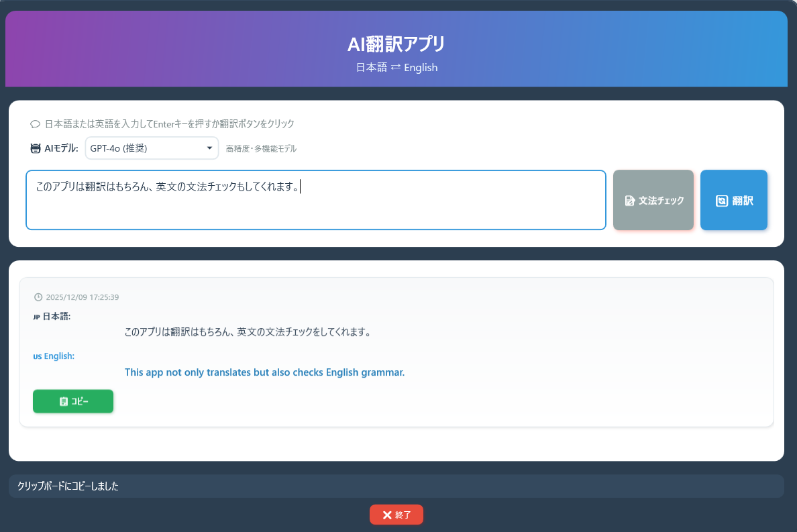

<div align="center">
  <h1><code>日本語⇔英語 AI翻訳アプリ</code></h1>
  <p>
    
  </p>
</div>

# 日本語⇔英語 AI翻訳アプリ

[](https://dotnet.microsoft.com/)
[](https://www.microsoft.com/windows)
[](LICENSE)

OpenAI GPTを活用した、日本語と英語の双方向翻訳および英文法チェック機能を備えたWindowsデスクトップアプリケーションです。


## 主な機能

### 双方向翻訳
- **日本語 → 英語**: 自然で正確な英訳を生成
- **英語 → 日本語**: 自然で読みやすい和訳を生成
- **自動言語検出**: 入力テキストの言語を自動判定

### 英文法チェック
- 英文の文法エラーを検出
- 修正案と詳細な説明を提供
- 自然な英語表現への改善提案

### 複数のAIモデル対応
- **GPT-4o**: 高精度・多機能モデル（推奨）
- **GPT-4o-mini**: 高速・コスト効率モデル
- **GPT-4-turbo**: バランス型高性能モデル
- **GPT-3.5-turbo**: 軽量・高速モデル

### その他の便利機能
- 翻訳履歴の表示
- ワンクリックでコピー機能
- モダンで使いやすいUI
- キーボードショートカット対応（Enter: 翻訳実行、Shift+Enter: 改行）

## インストール方法

### 事前準備

1. **OpenAI APIキーの取得**
   - [OpenAI Platform](https://platform.openai.com/)でアカウントを作成
   - APIキーを生成

2. **環境変数の設定**
   
   **方法1: Windows PowerShellを使用（推奨・最速）**
   
   1. PowerShellを開く（Windows + X → 「Windows PowerShell」または「ターミナル」）
   2. 以下のコマンドを実行：
   
   ```powershell
   # ユーザー環境変数に設定（推奨）
   [System.Environment]::SetEnvironmentVariable("OPENAI_API_KEY", "your-api-key-here", "User")
   ```
   
   3. PowerShellを再起動して設定を反映
   
   > **注意**: `your-api-key-here` の部分を、実際に取得したAPIキーに置き換えてください
   
   **方法2: Windowsの設定画面から**
   
   1. **Windows 11の場合**:
      - タスクバーの検索ボックスに「環境変数」と入力
      - 「システム環境変数の編集」を選択
      - 「環境変数」ボタンをクリック
   
   2. **Windows 10の場合**:
      - スタートメニューを右クリック → 「システム」を選択
      - 「システムの詳細設定」をクリック
      - 「環境変数」ボタンをクリック
   
   3. **環境変数の追加**:
      - 「ユーザー環境変数」セクションで「新規」ボタンをクリック
      - 変数名: `OPENAI_API_KEY`
      - 変数値: 取得したAPIキー（例: `sk-proj-xxxxxxxxxxxxx`）
      - 「OK」をクリックして保存
   
   4. すべてのダイアログで「OK」をクリックして閉じる
   
   5. 既に起動中のアプリケーションがある場合は再起動が必要です
   
   **方法3: コマンドプロンプトを使用**
   
   1. コマンドプロンプトを管理者として実行
   2. 以下のコマンドを実行：
   
   ```cmd
   setx OPENAI_API_KEY "your-api-key-here"
   ```
   
   3. コマンドプロンプトを再起動
   
   **設定の確認方法**
   
   PowerShellで以下のコマンドを実行して、環境変数が正しく設定されているか確認できます：
   
   ```powershell
   $env:OPENAI_API_KEY
   ```
   
   または
   
   ```powershell
   [System.Environment]::GetEnvironmentVariable("OPENAI_API_KEY", "User")
   ```

### ポータブル版（推奨）

プロジェクトの `publish` フォルダから、お使いのプラットフォームに合った実行ファイルをダウンロードして実行するだけです。

- **64ビット版**: `publish/portable/JapaneseEnglishTranslator.exe`
- **32ビット版**: `publish/portable-x86/JapaneseEnglishTranslator.exe`
- **ARM64版**: `publish/portable-arm64/JapaneseEnglishTranslator.exe`

> .NET Runtimeのインストールは不要です（セルフコンテインド形式）

### ソースからビルド

.NET 9.0 SDKが必要です。

```powershell
# リポジトリをクローン
git clone https://github.com/yourusername/JapaneseEnglishTranslator.git
cd JapaneseEnglishTranslator

# ビルド＆実行
dotnet build
dotnet run

# またはポータブル版を作成
dotnet publish -c Release -r win-x64 --self-contained true -p:PublishSingleFile=true -o publish/portable
```

## 使い方

### 基本的な翻訳

1. アプリを起動
2. 上部のテキストボックスに翻訳したいテキストを入力
3. 「翻訳」ボタンをクリック、またはEnterキーを押す
4. 翻訳結果が履歴エリアに表示されます

### 英文法チェック

1. 英文をテキストボックスに入力
2. 「文法チェック」ボタンをクリック（英文の場合のみ有効化）
3. 文法エラーと修正案が表示されます

### モデルの選択

- 画面左上のドロップダウンメニューからAIモデルを選択
- 用途に応じて最適なモデルを選択できます
  - 高精度な翻訳: GPT-4o
  - 高速処理: GPT-4o-mini / GPT-3.5-turbo

### 結果のコピー

- 各履歴アイテムの「コピー」ボタンをクリック
- 翻訳結果がクリップボードにコピーされます

## 技術スタック

- **フレームワーク**: .NET 9.0 (WPF)
- **言語**: C# 12.0
- **AI API**: OpenAI GPT-4 / GPT-3.5
- **HTTPクライアント**: HttpClient
- **JSONパーサー**: Newtonsoft.Json
- **UI**: XAML (Windows Presentation Foundation)

## プロジェクト構造

```
JapaneseEnglishTranslator/
├── App.xaml                    # アプリケーション定義
├── App.xaml.cs                 # アプリケーションロジック
├── MainWindow.xaml             # メインUIデザイン
├── MainWindow.xaml.cs          # メインロジック
├── AssemblyInfo.cs             # アセンブリ情報
├── JapaneseEnglishTranslator.csproj  # プロジェクトファイル
├── Resources/                  # リソースファイル
│   ├── translator-icon.ico    # アプリケーションアイコン
│   └── translator-icon.png    # PNGアイコン
├── publish/                    # ビルド済み実行ファイル
│   ├── portable/              # x64版/x86版/ARM64版
└── README.md                   # このファイル
```

## 設定

### APIキーの変更

環境変数 `OPENAI_API_KEY` を変更後、アプリを再起動してください。

### モデルの変更

アプリ内のドロップダウンメニューから、いつでもモデルを変更できます。

## APIコストについて

このアプリはOpenAI APIを使用するため、使用量に応じて課金されます。

| モデル | 入力コスト | 出力コスト | 推奨用途 |
|--------|-----------|-----------|----------|
| GPT-4o | $2.50/1M tokens | $10.00/1M tokens | 高精度翻訳 |
| GPT-4o-mini | $0.15/1M tokens | $0.60/1M tokens | 日常的な翻訳 |
| GPT-4-turbo | $10.00/1M tokens | $30.00/1M tokens | 専門的な翻訳 |
| GPT-3.5-turbo | $0.50/1M tokens | $1.50/1M tokens | 簡易翻訳 |

> コストを抑えるには、GPT-4o-mini または GPT-3.5-turbo の使用を推奨します。

## トラブルシューティング

### APIキーエラーが表示される

- 環境変数 `OPENAI_API_KEY` が正しく設定されているか確認
- PowerShellを再起動してから、アプリを起動
- APIキーが有効か、OpenAI Platformで確認

### 翻訳が実行されない

- インターネット接続を確認
- OpenAI APIの状態を確認: https://status.openai.com/
- APIキーの利用制限を確認

### アプリが起動しない

- Windows 10/11であることを確認
- .NET 9.0 Runtime（ポータブル版は不要）
- セキュリティソフトがブロックしていないか確認

## ライセンス

このプロジェクトはMITライセンスの下で公開されています。詳細は[LICENSE](LICENSE)ファイルを参照してください。

## 謝辞

- [OpenAI](https://openai.com/) - GPT APIの提供
- [.NET Foundation](https://dotnetfoundation.org/) - .NETフレームワーク
- [Newtonsoft.Json](https://www.newtonsoft.com/json) - JSONライブラリ

---

**開発者**: Hiroshi Nakajima
**バージョン**: 1.0.0.0  
**最終更新**: 2025年12月
